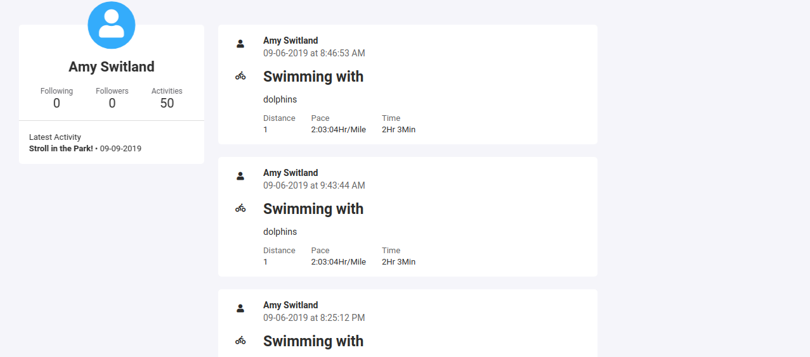

<h1 align="center">CycleCycleCycle</h1>
<div align="center">Where users can track their physical activity with Google API Maps or manual entry.</div>

<div align="center">
  <!-- Stability -->

  <!-- NPM version -->
  
  <!-- Build Status -->
 
</div>

[Live Site][1]

---

- [Features](#features)


## Features

- Nodejs Backend
- MongoDB content storage
- Express HTTP Routes
- React Frontend with Apollo GraphQL Queries
- JavaScript Web Token Login / Registration pattern
- Google Maps API Direction Service


## Background

CycleCycleCycle is a minimal viable product that tackles three challenges in application development, software engineering, and user experience. 


### App Data Flow

#### Authentication

An un-authenticated user will only have access to `/login` and `/register` paths. This is accomplished by setting up an `Auth` React component that returns an Apollo `Query` to check if a user is logged in. 

+ `Auth`

```js
const Auth = ({ component: Component, path, exact, ...rest }) => (
  <Query query={IS_LOGGED_IN}>
    {({ data }) => {
      
      return (
        <Route
          path={path}
          exact={exact}
          render={props =>
            !data.isLoggedIn ? (
              <Component {...props} />
            ) : (
              <Redirect to="/dashboard" />
            )
          }
        />
      );
    }}
  </Query>
);
```

![session][docs/signup.png]

When a user submits login information from the frontend, a React Apollo `Mutation` component will use a predefined `LoginUser` mutation: 

```js
{LoginUser => (
              <form
                onSubmit={e => {
                  e.preventDefault();

                  LoginUser({
                    variables: {
                      email: this.state.email,
                      password: this.state.password
                    }
                  });
                }}
                //....
```

The user input form data and the `login` graphQL mutation will in turn be sent as an object to a backend route.

```js
 mutation LoginUser($email: String!, $password: String!) {
      login(email: $email, password: $password) {
        token
        loggedIn
        _id
      }
    }
```

This backend route is handled by `Express.js` which takes in the request and parses it through `expressGraphQL` middleware. 


The middleware will run the mutation against a `login` field in a `GraphQLObjectType`  

```js
const mutation = new GraphQLObjectType({
  n name: "Mutation",
  fields: {
    login: {
      type: UserType,
      args: {
        email: { type: GraphQLString },
        password: { type: GraphQLString }
      },
      resolve(_, args) {
        return AuthService.login(args);
      }
      //...
```

If the requested mutation matches the predefined `UserType` data fields:

```js
const UserType = new GraphQLObjectType({
  name: "UserType",
  fields: {
    _id: { type: GraphQLID },
    fname: { type: GraphQLString },
    lname: { type: GraphQLString },
    email: { type: GraphQLString },
    token: {type: GraphQLString},
    loggedIn: { type: GraphQLBoolean }
  }
});
```

The arguments will then be passed to a resolver function which interfaces with a remote mongoDB cluster.


This `login` function utilizes three utilities to create an entry into the database:

+ `validator` - to validate input data 
+ `mongoose` - Instantiate schemas and functions to query and interface data with a remote mongodb cluster.
+ `JavaScript Web Token`T o create a web token for frontend authentication. 


```js
const login = async data => {
  try {
    const { message, isValid } = validateLoginInput(data);
    if (!isValid) {
      throw new Error(message);
    }

    const { email, password } = data;

    const existingUser = await User.findOne({ email });

    if (!existingUser) throw new Error("This user does not exist");

    const validPWord = await bcrypt.compareSync(
      password,
      existingUser.password
    );

    if (!validPWord) throw new Error("Invalid Password");

    const token = jwt.sign({ id: existingUser._id }, keys.secretOrKey);
    return { token, loggedIn: true, ...existingUser._doc, password: null };
  } catch (err) {
    throw err;
  }
};

```

On success the resolver will return an object back to the frontend where the response data is set in the cache and local storage:

```js
 <Mutation
        mutation={LOGIN_USER}
        onCompleted={data => {
          const { token, _id } = data.login;
          localStorage.setItem("auth-token", token);
          localStorage.setItem("currentUserId", _id);
          this.props.history.push("/dashboard");
        }}
        onError={err => {
          this.setState({ message: err.message.split(":")[1] });
        }}
        update={(client, data) => this.updateCache(client, data)}
      >
```


The authenticated user will have access to the `Protected` routes such as the `/dashboard`

```js
const Protected = ({ component: Component, path, exact, ...rest }) => (
  <Query query={IS_LOGGED_IN}>
    {({ data }) => {
      
      return (
        <Route
          {...rest}
          render={props =>
            data.isLoggedIn ? (
              <Component {...props} />
            ) : (
              <Redirect to="/" />
            )
          }
        />
      );
    }}
  </Query>
);
```




## Maps

Users can plot out their phisical activity using google maps.


This is accomplished by leveraging Google Maps API along side React components. 


When an authenticated user navigates to `/routes/new`, React's `componentDidMount` function sets up 3 key Google Objects:

+ `Map` - To display the map
+ `DirectionsService` - To fetch turn-by-turn directions and coordinates
+ `Polyline` - Draw svg lines on the `Map` object.

The `Map` object in particular is binded with an `click` event to append the coordinates from which a user clicks on to a react commponents local state. 

```js

handleClick() {
    window.google.maps.event.addListener(this.map, "click", event => {
      let point = {
        location: {
          lat: event.latLng.lat(),
          lng: event.latLng.lng()
        },
        stopover: false
      };

      this.setState({ routes: [...this.state.routes, point] });

      this.calculateAndDisplayRoute();
    });
  }

```

After the local state is updated the next step is to run the coordinates array through Google Direction Service that will calculate the route details and use the Polyline to render out the changes.

```js
this.directionsService.route(options, (res, status) => {
      if (status === "OK") {
        this.markerArray.forEach(marker => marker.setMap(null));
        this.setState({ route_details: res.routes[0].legs[0] });

        let start = new window.google.maps.Marker({
          position: this.state.routes[0].location,
          icon: {
            path: window.google.maps.SymbolPath.CIRCLE,
            scale: 4
          },
          map: this.map
        });
        this.markerArray.push(start);
        if (this.state.routes.length > 1) {
          let finish = new window.google.maps.Marker({
            position: this.state.routes[this.state.routes.length - 1].location,
            icon: {
              path: window.google.maps.SymbolPath.BACKWARD_CLOSED_ARROW,
              scale: 4
            },
            map: this.map
          });
          this.markerArray.push(finish);
        }
        if (this.state.routeType === "polyline") {
          this.renderPolyLine(res);
        } else {
          this.directionsDisplay.setDirections(res);
        }
      } else {
      }
    });
```


[1]: http://echohive.herokuapp.com/